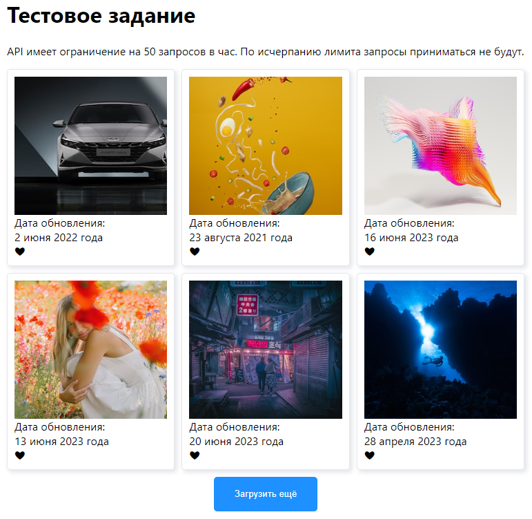

# Unsplash API galery test task

Тестовое задание.
С помощью Unsplash API получает информацию о фотографиях и отображает их. Реализованы пагинация, возможность поставить лайк.

Ссылка на прод: https://image-list-gray.vercel.app/

Стэк: JavaScript, ReactJS, React Router, Redux, Thunk, Redux-Toolkit, HTML, CSS

API имеет ограничение на 50 запросов в час. По исчерпанию лимита запросы приниматься не будут.

# Скриншоты
